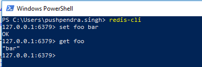

## Cross cutting components

This project contains those components of the platform that are used in all layers. Cache and Eventing are two such components. 

### Cache

[Redis](https://redis.io/) will be used as a cache service. Below are the instructions to run redis in docker and connect with redis-cli on windows.

Install [Docker for windows](https://docs.docker.com/docker-for-windows/) and switch to linux containers. Launch command prompt and run following command

`docker run --name yoeventsredis -p 6379:6379 redis`

Above should run redis in a docker container. Next step is to install redis-cli to be able to access redis from command line for testing purposes.
Install [Chocolatey](https://chocolatey.org/) and then use chocolatey to install redis with below [command](https://www.chocolatey.org/packages/redis-64/)

`choco install redis-64`

Once redis is installed on windows, run below commands in the command prompt

`redis-cli`

That should connect to redis instance and one can send commands now, test as shown below

