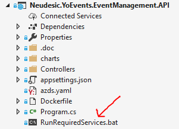
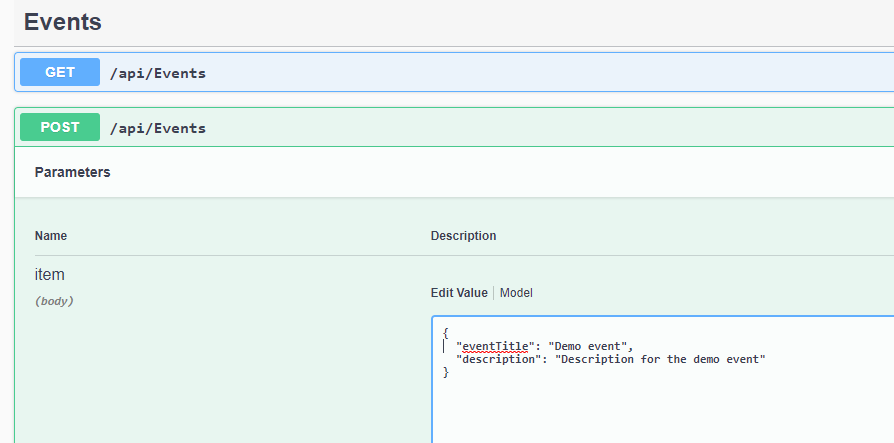

## Event Management microservice

Swagger is configured to provide a comprehensive list of end points

Database setup is needed to run the service successfully. Follow below instructions for database setup

1. Download the [postgres db installer](https://www.postgresql.org/download/windows/) and run.
2. Setup the password for default user (`postgres`) when prompted as `pass@word1`
3. Run `pgAdmin` and make sure you're able to connect to database

**Note**: One good alternative to `pgAdmin` is [`DBeaver`](https://dbeaver.io/download/) which can be used as client for multiple databases.

Once database is setup, follow below to run the service 

1. Select `Neudesic.YoEvents.EventManagement.API` as start up project. 
2. Select `Neudesic.YoEvents.EventManagement.Infrastructure` as default project in Package Manager Console and 
 execute **`Update-Database`** command
3. Run/Debug `Neudesic.YoEvents.EventManagement.API`.
4. Ensure you're able to make api calls from swagger api.
5. Validate data in database via `pgAdmin`

Before this service can be run, there needs to be at least one organization/tenant setup. That should be done before hand by running 
`Neudesic.YoEvents.AppAdmin.API` microservice and creating an organization.

Execute **`RunRequiredServices.bat`** before running this api.

#### Create Event

To create an event from swagger UI, remove the id & tenantId fields from the payload as they dont need to be set, see below

